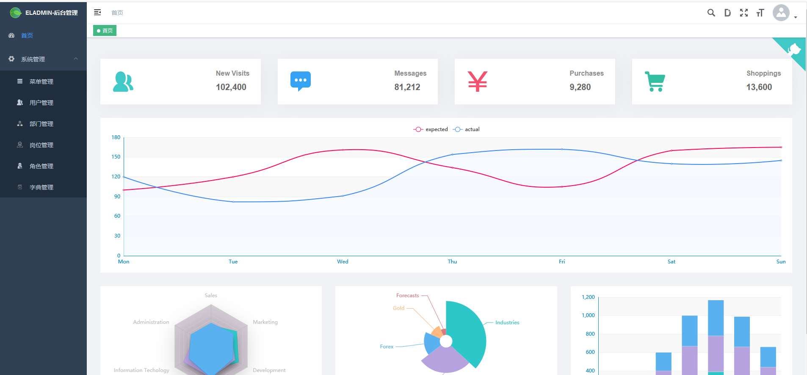
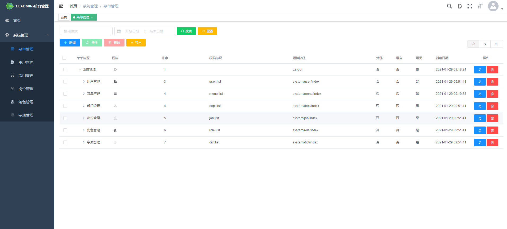
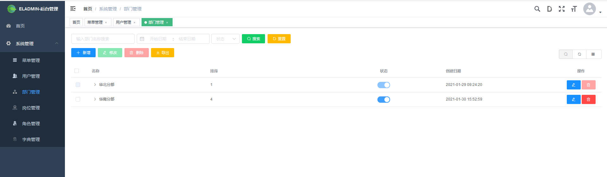
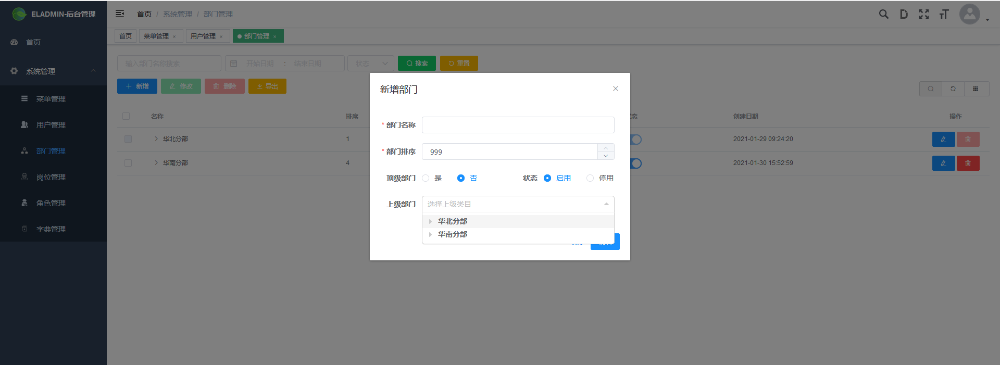
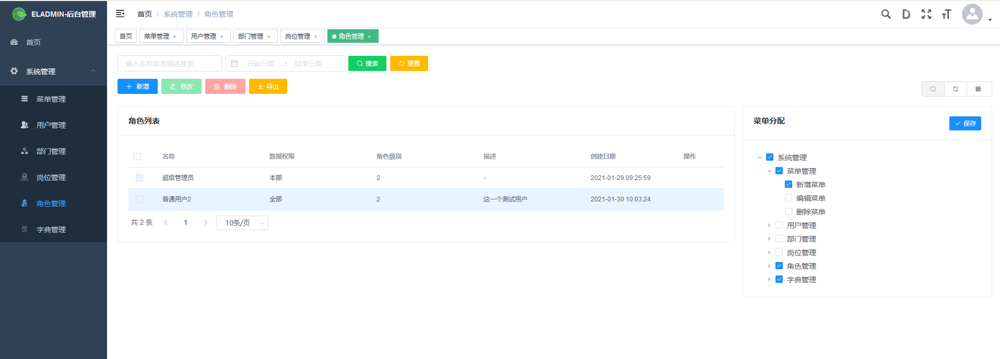
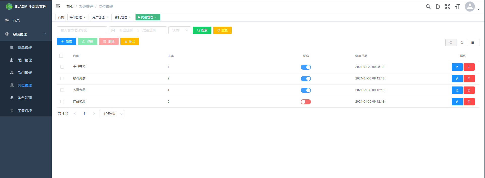
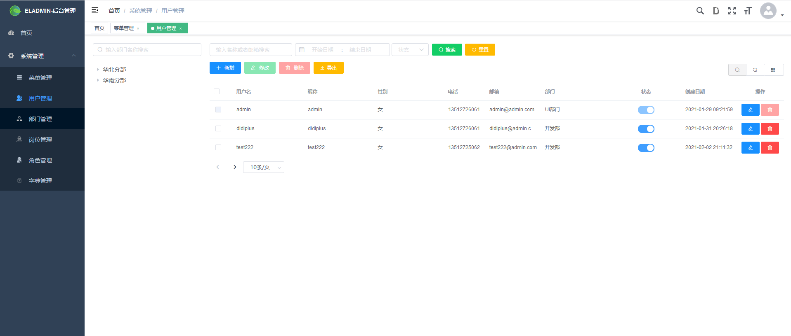
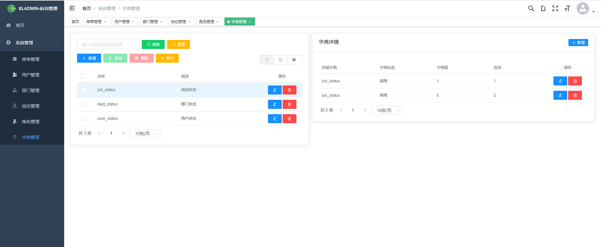

# Flask_admin

#### 介绍
本项目构建一个权限管理系统，采用Flask框架，开发接口，前端采用vue框架。主要参考el-admin该开源项目。

#### 软件架构
- Python 3.6.9
- Flask  1.1.2
- Mysql  5.7.0


#### 安装教程

1.  安装python 3.6开发环境
```
#安装好python环境，创建虚拟隔离环境
python3.6 -m venv  venv
#注释 使用venv模块需要提前下载安装该模块 上述命令第一个venv是指定模块名称，第二个是目录名称，随意起就行了。

#激活虚拟隔离环境
linux环境：
didiplus@DESKTOP-DOBAOAT:~$ source venv/bin/activate
(venv) didiplus@DESKTOP-DOBAOAT:~$ 
```
2.  下载Flask_admin项目
```
git colne git@gitee.com:didiplus/Flask_admin.git

```

3.  安装python依赖包
```
(venv) didiplus@DESKTOP-DOBAOAT:~/Flask_admin$ pip install -r requirements.txt 
```
4. 新建数据库，并导入测试数据
```
create database eladmin;
#把项目目录的eladmin.sql脚本文件导入到eladmin数据库中。
mysqldump -uroot -pmim  eladmin < eladmin.sql
```
5.  启动后端程序
```
didiplus@DESKTOP-DOBAOAT:~/Flask_admin$ python manager.py runserver
 * Serving Flask app "apps" (lazy loading)
....省略....
```
6. 下载前端程序
```
git@gitee.com:didiplus/eladmin-web.git
```
7. 启动前端程序
```
# 安装依赖
npm install

# 启动服务 localhost:8013
npm run dev
```
#### 使用说明

1.  登录系统，超级管理员用户:admin,密码123456


2.  登录成功之后，首页展示



3.  菜单管理页面



4.  部门管理页面，添加部门信息





5. 角色管理页面



6. 岗位管理页面



7. 用户管理页面



8. 字典管理页面



#### 参与贡献

1.  参考[el-admin](https://gitee.com/elunez/eladmin)


